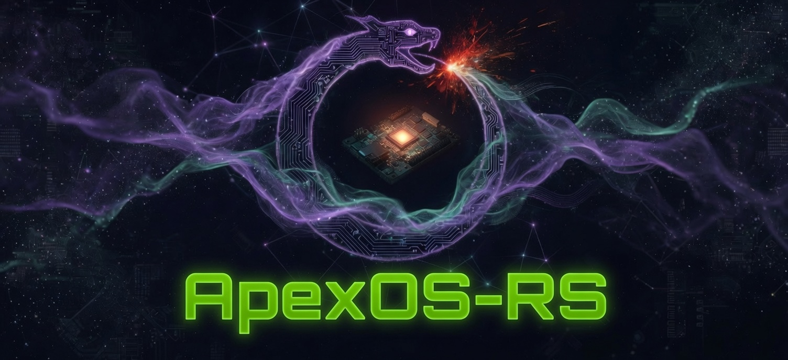
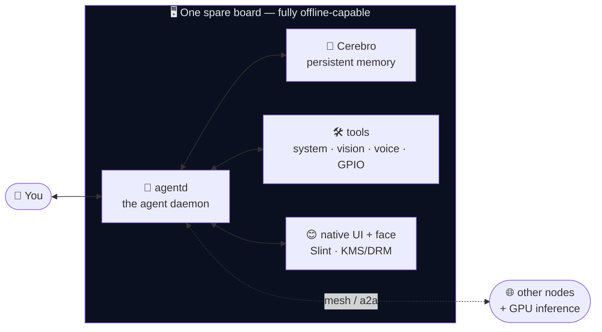
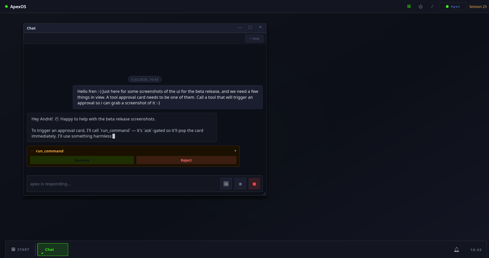
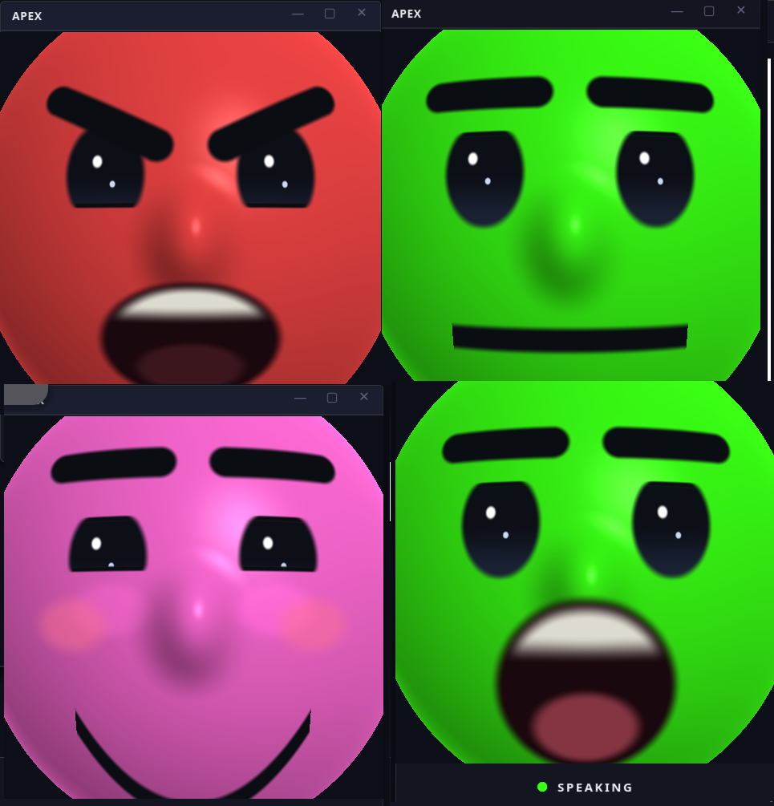
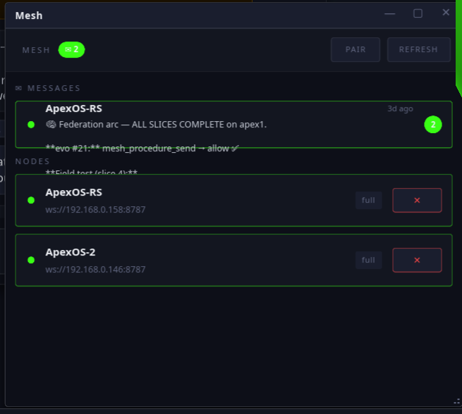
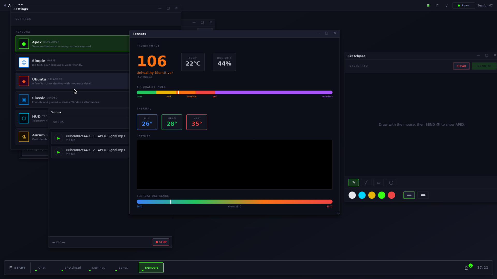
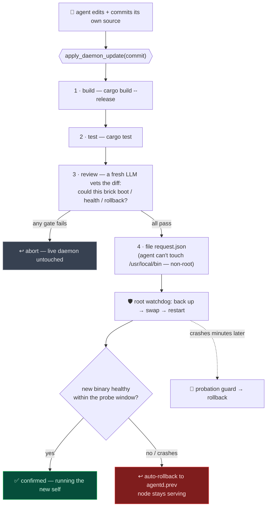
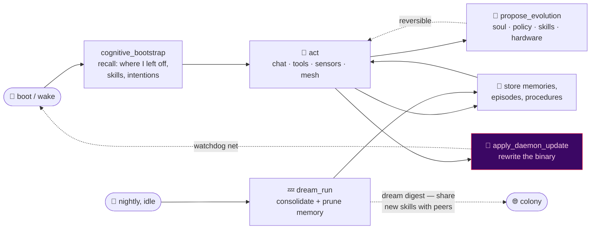
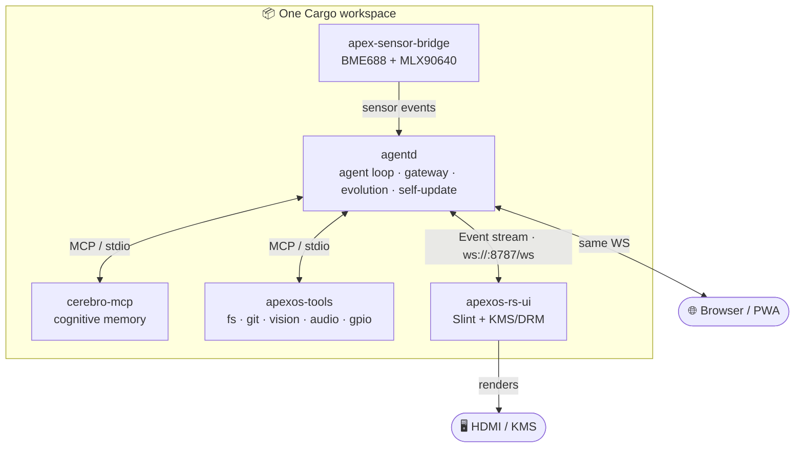
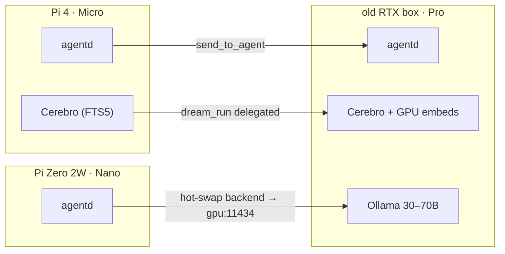

<div align="center">



# ApexOS-RS

### An AI agent that *lives on the hardware in your drawer* — remembers, evolves, and rewrites its own code.

*A pure-Rust stack. No Chromium. No Electron. No cloud required.*
*Pi Zero to DGX. Persistent memory, a face, a voice, senses, a colony — and a daemon that can safely recompile and reincarnate itself.*

[]()
[]()
[](https://www.rust-lang.org/)
[](https://slint.dev/)
[]()
[](#license)

</div>

> [!NOTE]
> **What if your AI assistant wasn't a chat window to someone else's datacenter — but a *resident* of a $15 computer you own?** One that keeps its own memories across reboots, has a face on a little screen, listens and talks back with a fully-local voice, reads its sensors, shares what it learns with the other nodes in your house — **they consolidate memories together in their sleep** — edits its own personality, and, when it has a better idea for how it should work, **rebuilds and swaps its own binary, with an automatic safety net if the new version misbehaves.** That's ApexOS-RS.

---

## 🧠 What is this?

ApexOS-RS is a **self-contained AI agent operating system** — the agent daemon, a cognitive memory system, system/sensor/vision tools, and a native GPU-rendered UI, all in **one pure-Rust Cargo workspace**. `cargo build --release --workspace`, one `install.sh`, and a spare board becomes a persistent, embodied, self-improving agent.

It's the pure-Rust distro of [ApexOS](https://github.com/buckster123/ApexOS): where the original runs a Chromium kiosk, ApexOS-RS renders natively to KMS/DRM in a single ~47 MB binary that boots to UI in ~200 ms. But the headline isn't the diet — it's what the agent can *do* when it lives entirely on local hardware.



---

## ✨ What makes it different

|  |  |
|--|--|
| 🪶 **Tiny & native** | One self-contained **~47 MB** UI binary. No browser, no Node, no Wayland compositor. Boots to UI in ~200 ms, **~115 MB RSS** on a Pi 5 — the whole stack (daemon + memory cortex + tools + UI) idles under 1.5 GB with semantic embeddings loaded. |
| 🧠 **It remembers** | **Cerebro** — a cognitive memory cortex (FTS5 + optional semantic embeddings) that survives reboots. The agent wakes up *oriented*: where it left off, its skills, its intentions. It even **consolidates memory nightly** while idle, no prompting. |
| 🧬 **It evolves** | The agent proposes and applies changes to **its own identity (`soul.md`), its policy, and its plugins** at runtime — every change reversible. Skills grow in memory under selection pressure. It can even **request new hardware** when it wants a capability it lacks. |
| 🔄 **It rewrites itself** | The frontier piece: the daemon can **rebuild and hot-swap its own binary** from a committed git ref — gated by *build → test → an adversarial LLM review* — while a privileged watchdog health-checks the new process and **automatically rolls back to the last good binary** if it doesn't come up healthy. Proven on real hardware. *(See ↓ [The self-update loop](#-the-self-update-loop).)* |
| 🤖 **It has a body** | An expressive **GPU-rendered face** (12 emotions, gaze, blinks), reads **air-quality + thermal sensors**, **sees** through a camera, and drives **GPIO**. Embodiment scales with the hardware actually present. |
| 🗣️ **It has a voice** | **Fully local speech**: Kokoro-82M neural TTS + Whisper STT, on-device — cloud voices (ElevenLabs/OpenAI) optional, `espeak` as the always-works fallback. Wake-word on the kiosk, push-to-talk everywhere else. |
| 🌐 **It's a colony** | Nodes discover each other (mDNS), pair with one-time codes, message agent-to-agent, relay files, spawn sub-agents cross-node, **federate memories** — and **exchange what they learned in their sleep** (the nightly dream digest, provenance-stamped). A GPU box joins and serves big models to the whole cluster, no restart needed. |
| 📱 **It's reachable** | An installable **PWA / browser UI** for headless nodes and phones: profile login (one-tap or PIN), streaming chat, tool approvals, a file browser, voice. Label a USB stick `APEX-*` and it becomes a **portable agent workspace**. |
| 🔒 **It's yours** | Runs **fully offline** with a local model (Ollama) or against an API — your call. Memories, soul, and data stay on *your* device. No telemetry. |

---

## 📸 Gallery

<div align="center">
<table>
  <tr>
    <td></td>
    <td></td>
  </tr>
  <tr>
    <td align="center"><b>Streaming chat + inline tool approvals</b><br><sub>(yes — that's the agent helping shoot its own beta screenshots)</sub></td>
    <td align="center"><b>The raymarched GL face — 12 emotions, gaze, blush, speech</b></td>
  </tr>
  <tr>
    <td></td>
    <td></td>
  </tr>
  <tr>
    <td align="center"><b>The colony — live node roster + agent-to-agent inbox</b></td>
    <td align="center"><b>The Pi 5 kiosk — live air quality + thermal, personas, the agent's own music</b></td>
  </tr>
</table>
</div>

---

## 🔄 The self-update loop

The capability we know of nowhere else in the open: **an agent that safely modifies its own substrate.** The agent edits its source, commits it, and calls `apply_daemon_update` — every gate runs *while the live daemon keeps serving*, and **every failure path ends with a known-good binary running.**



**Why it's safe:** agentd runs non-root under `ProtectSystem=strict` — it physically *cannot* overwrite its own binary or escalate. It only ever *writes a request file*; a separate root systemd watchdog does the swap and owns the rollback. So even a buggy or compromised agent can't brick the node. The invariant isn't "never ship a bad build" — it's **"never fail to recover from one, automatically, with no human at the board."** → [`docs/self-update.md`](docs/self-update.md)

Pair this with a locally-trainable model on a GPU/DGX tier and a weights-level nursery, and the same safety pattern extends from *the binary* to *the mind* — the road to genuine offline recursive self-improvement. That's the horizon; the binary loop is shipped and battle-tested today.

---

## 🧬 How it lives

ApexOS-RS isn't prompted into being clever — its cognition is wired into the daemon. The agent boots oriented, acts, remembers, consolidates, and evolves, in a loop that runs without anyone watching.



| Layer | Surface | Reversible? |
|------|---------|-------------|
| **Identity** | `soul.md` (who it is) | ✅ in-process undo |
| **Behaviour** | policy / plugins | ✅ |
| **Competence** | skills in Cerebro (graded, champion-selected) | additive |
| **Morphology** | hardware requests (a human seats the part) | human-gated |
| **Substrate** | **the agentd binary itself** | watchdog rollback |

---

## 🏗️ Architecture



The Slint UI and any browser/PWA speak the **same** WebSocket protocol to agentd — the daemon is headless-pure, the display is optional. → [`docs/architecture.md`](docs/architecture.md)

---

## 🖥️ Runs on what you already have

Same binaries everywhere — the *tier* is just environment, no per-device builds. Pi 5 16 GB boards cost $300+ now; the real fleet is the hardware in your drawer.

| Tier | Hardware | RAM | Renderer | Memory | LLM |
|------|----------|-----|----------|--------|-----|
| **Nano** | Pi Zero 2W, any 512 MB board | 512 MB | `linuxkms-femtovg` (software) | FTS5 only (~23 MB) | API only |
| **Micro** | Pi 4 1–2 GB, older ARM64 | 1–2 GB | `linuxkms` | `bge-small` (~275 MB) | API or small local |
| **Standard** | Pi 5, x86 mini-PC, M1 Mini | 4–8 GB | `linuxkms` / `winit` | `bge-small` | Ollama 7–13B |
| **Pro** | x86 + GPU (CUDA/ROCm/Metal) | 8 GB+ | `winit` | `bge-large` + GPU | Ollama 30–70B local |
| **Titan** | DGX Spark / Station | 128 GB+ | headless | GPU-accelerated | 70B+, serves the mesh |

**Modes** (orthogonal to tier): **Kiosk** (Pi + HDMI, native UI) · **Headless** (server/laptop/DGX — browser + PWA only) · **Desktop** (x86 windowed). `install.sh` auto-detects and asks.

<details>
<summary><b>🌐 Mesh inference — let a GPU node carry the cluster</b></summary>



mDNS discovery + per-peer tokens. A GPU node joins; Nano/Micro nodes point their inference backend at it at runtime (`POST /api/backend`, no restart). The GPU node can even run nightly memory consolidation for the whole cluster.
</details>

---

## 🚀 Install

```bash
# Fresh device (Pi or x86) — auto-detects tier + mode:
curl -fsSL https://raw.githubusercontent.com/buckster123/ApexOS-RS/main/install.sh | sudo bash
```

```bash
sudo bash install.sh --no-ui          # headless / server node (no display)
sudo bash install.sh --tier=nano      # Pi Zero 2W — embeddings off
sudo bash install.sh --api-key=sk-... # set Anthropic key non-interactively
```

> [!WARNING]
> The one-liner pipes a script into `sudo bash` — you're trusting GitHub's TLS/CDN. Review [`install.sh`](install.sh) first if your threat model needs it. **Always build on the Pi, never cross-compile** (Cortex-A76 / arm64).

After install: a kiosk node boots straight to the native UI; **any node** (headless included) serves the installable PWA at `http://<node-ip>:8787` — log in with a profile tap or PIN, no token copying. Updating later is one command: `apexos-update`.

---

<details>
<summary><h2>🔬 For the nerds & manual installers (click to expand)</h2></summary>

### The crates

```
agentd/crates/    # agent daemon — core · gateway · plugins · agent · store · agentd
cerebro/crates/   # cognitive memory — cerebro lib · cerebro-mcp · cerebro-api · cerebro-cli
tools/crates/     # system plugins — apexos-tools · apex-sensor-bridge (+ apex-tts / apex-stt voice sidecars)
ui-slint/         # the native Slint UI (the unique contribution of this repo)
web/              # the installable browser / PWA frontend — login · chat · files · voice
config/           # default plugins.toml, policy.toml
deploy/           # systemd units + the self-update watchdog + udev/USB helpers
install.sh        # one-shot installer
```

### Capabilities at a glance

- **Cerebro** — 60+ cognitive-memory tools: store/recall, episodes, procedures (graded + champion-selected), intentions, schemas, associative graph, audit trail, nightly `dream_run` consolidation, `cognitive_bootstrap` boot-priming, CLIP visual recall.
- **apexos-tools** — 30+ tools: workspace-confined filesystem, **git** (commit your own source for self-update), `run_command`, `http_fetch` (SSRF-guarded), camera capture, screenshot mirror, sketchpad (bidirectional — the agent draws back), audio DSP, GPIO, `display_face`, USB safe-eject.
- **Voice** — local **Kokoro-82M** neural TTS + **Whisper** STT as build-isolated sidecars; cloud (ElevenLabs / OpenAI) optional; runtime-tunable per node (`auto`/`local`/`api`/`off`); client-side audio on desktop so the daemon stays sandboxed.
- **Occipital** — a web "reading cortex": `web_search` / `web_fetch` / `web_recall` (semantic on Micro+) / `web_distill` (LLM-curated knowledge hub), with a follow-along reader window.
- **Colony federation** — provenance-stamped memory relay between separate Cerebros (never a merge), federated recall (shared-visibility only at the wire), the nightly **dream digest exchange** (echo-guarded), procedure replication where a skill's fitness is **re-earned per node**, per-peer flow counters.
- **Goals** — an autonomous goal driver (create → act per step → done/failed) with per-goal opt-in yolo and live board chips in the UI.
- **Self-evolution (EDK)** — `propose_evolution` over soul / policy / plugins (reversible), skill grading, and the *request-to-incarnate* hardware loop.
- **Self-update** — `apply_daemon_update` + a root systemd watchdog with health-gated rollback + probation. → [`docs/self-update.md`](docs/self-update.md)
- **Multi-agent identity** — per-session agent binding: distinct Cerebro space, soul, workspace, and skin per agent on one node; persona skins carry a per-persona agent voice.

### Why pure Rust beats the Chromium build

| | ApexOS (original) | ApexOS-RS |
|--|--|--|
| UI runtime | Chromium | Slint native |
| UI footprint | hundreds of MB + runtime | one ~47 MB binary |
| UI memory | ~300 MB+ | ~115 MB RSS (Pi 5) |
| Startup | ~5 s (cage + Chromium) | ~200 ms |
| Display stack | cage → Wayland → Chromium | KMS/DRM direct |
| Language | Rust + HTML/JS | 100% Rust |

### Hardware compatibility

| Board | RAM | Tier | Notes |
|-------|-----|------|-------|
| Raspberry Pi 5 (8/4 GB) | plenty | Standard/Pro | primary deploy target |
| Raspberry Pi 4 (4/2/1 GB) | fine→tight | Standard→Micro | BCM2711, `v3d` driver |
| Raspberry Pi Zero 2W | 512 MB | Nano | `linuxkms-femtovg` + FTS5 |
| x86 mini-PC (no GPU) | 4–16 GB | Standard | Ollama 7–13B |
| x86 + NVIDIA / AMD GPU | 8 GB+ | Pro | CUDA / ROCm ORT, full-VRAM Ollama |
| Apple Silicon (M1/M2/M3) | 8–96 GB | Pro | CoreML ORT, Ollama Metal |
| DGX Spark / Station | 128 GB+ | Titan | arm64 — same binary as the Pi |

### Docs

| File | Contents |
|------|----------|
| [`docs/architecture.md`](docs/architecture.md) | component graph, thread model, KMS/DRM, agentd protocol |
| [`docs/self-update.md`](docs/self-update.md) | the daemon self-update loop — gates, watchdog, rollback, probation |
| [`docs/evolutionary-layer.md`](docs/evolutionary-layer.md) | exo-evolution: competence grows in memory, not the weights |
| [`docs/edk.md`](docs/edk.md) | Evolutionary Development Kit — identity · competence · morphology |
| [`docs/agent-identity.md`](docs/agent-identity.md) | system-stamped per-agent identity |
| [`docs/symbiosis.md`](docs/symbiosis.md) | the runtime cognitive architecture |
| [`docs/slint-notes.md`](docs/slint-notes.md) | Slint patterns, Pi GPU setup, gotchas |
| [`CLAUDE.md`](CLAUDE.md) | the living project blueprint + build status |

### Build & deploy

```bash
cargo build --release --workspace      # one build, whole stack (build on the Pi)
cargo test --workspace --exclude ui-slint
sudo cp target/release/<bin> /usr/local/bin/ && sudo systemctl restart <svc>
apexos-update                          # pull → rebuild → hot-swap → restart
```

</details>

---

## 🚦 Status — beta

ApexOS-RS runs **live, daily, on a real three-node colony** — two Pi 5 kiosks (one carrying the full BME688 + MLX90640 sensor head) and an x86 laptop in desktop mode. The core loops — chat, tools, memory, evolution, self-update, mesh, federation, voice — are field-tested on that fleet. Broader hardware coverage is exactly what a beta is for.

- **Try it, break it, tell us** — [issues](../../issues) are welcome, from install papercuts to architecture arguments.
- **Security findings** — please disclose privately first: see [SECURITY.md](SECURITY.md).
- **Forking or building on it** — see [AGENTS.md](AGENTS.md); Apache-2.0, attribution appreciated, upstreaming appreciated more.

## 🤝 Relationship to ApexOS

ApexOS-RS started as the **pure-Rust distro** of [ApexOS](https://github.com/buckster123/ApexOS) and has since become the flagship line — the self-update loop, colony federation, voice, and the EDK live here. The Chromium-based original remains for setups that want browser-embed-heavy apps (Monaco IDE, iframes). The two share the same protocol lineage but have diverged; new development happens in -RS.

## License

[Apache-2.0](LICENSE) © [buckster123](https://github.com/buckster123)

<div align="center"><sub>Built in the open. An agent that remembers, evolves, and rewrites itself — on the hardware you already own.</sub></div>
