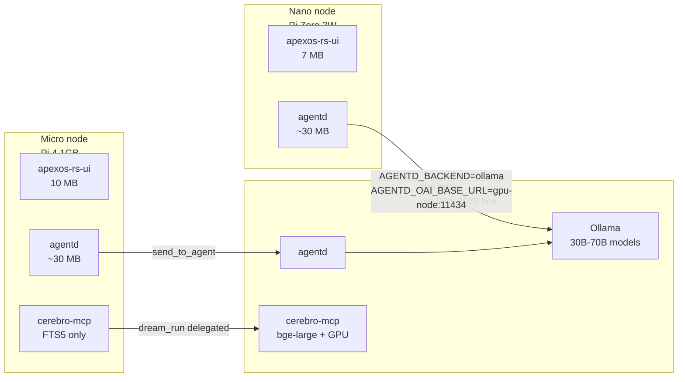
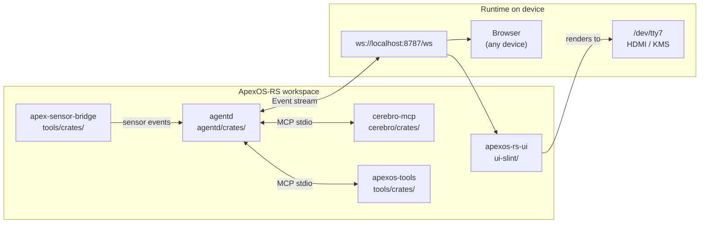

<div align="center">

# ApexOS-RS

**Pure-Rust native UI distro of [ApexOS](https://github.com/buckster123/ApexOS)**

*Slint frontend · KMS/DRM direct rendering · No Chromium · No Wayland · ~10 MB RAM*

[]()
[](https://www.rust-lang.org/)
[](https://slint.dev/)
[](https://www.raspberrypi.com/)

</div>

---

## What is this?

ApexOS-RS is the pure-Rust distro of [ApexOS](https://github.com/buckster123/ApexOS). One repo, one `cargo build --release --workspace`, one `install.sh`. Everything runs.

Where canonical ApexOS bundles Chromium, Python plugins, and a JS frontend, ApexOS-RS replaces all of it with Rust:

| Canonical ApexOS | ApexOS-RS |
|-----------------|-----------|
| Chromium kiosk | Slint native UI (KMS/DRM) |
| Python cerebro-mcp | cerebro-mcp (Rust, 66 tools) |
| JS/HTML frontend | Slint `.slint` components |
| cage + seatd + Wayland | direct KMS/DRM, zero compositor |

The Slint UI connects to `ws://localhost:8787/ws` — the same protocol as the browser frontend. agentd is unchanged.

```
┌─────────────────────── ApexOS-RS workspace ─────────────────────────────┐
│                                                                           │
│  agentd        ──── ws://localhost:8787/ws ──┬──→ Browser / PWA          │
│  cerebro-mcp   (MCP plugins over stdio)      │                            │
│  apexos-tools  (MCP plugins over stdio)      apexos-rs-ui                │
│  sensor-bridge (WS events → agentd)       (Slint + KMS/DRM)              │
│                                           renders to /dev/tty7            │
└───────────────────────────────────────────────────────────────────────────┘
```

---

## Why?

| | ApexOS (original) | ApexOS-RS |
|--|--|--|
| UI runtime | Chromium | Slint native |
| UI memory | ~300 MB | ~10 MB |
| Startup | ~5s (cage + Chromium) | ~200ms |
| Display stack | cage → Wayland → Chromium | KMS/DRM direct |
| Target hardware | Pi 5 primary | Pi 4, Pi 5, Zero 2W |
| Language | Rust + HTML/JS | 100% Rust |

ApexOS-RS is for:
- **Lower-spec hardware** — Pi 4 (2/4GB), Pi Zero 2W, any board where 300MB for Chromium is too much
- **Faster bring-up** — sub-second from boot to UI
- **Embedded / industrial** — no browser attack surface, no Wayland compositor to crash
- **Pure-Rust credibility** — the whole stack in one language

Both distros share the same `agentd` backend. You choose your frontend.

---

## Platform tiers

The stack runs in a tiered configuration — the same binaries, different env vars. No special builds per device.

| Tier | Hardware | RAM | Renderer | Embeddings | LLM | RSS target |
|------|----------|-----|----------|-----------|-----|-----------|
| **Nano** | Pi Zero 2W, any 512MB Linux board | 512MB | `linuxkms-femtovg` (software) | disabled (FTS5 only) | API only | ~60 MB total |
| **Micro** | Pi 4 1-2GB, older ARM64 boards | 1-2GB | `linuxkms` | `bge-small` 384-dim | API or small local | ~350 MB |
| **Standard** | Pi 5 4-8GB, x86 mini-PC, M1 Mac Mini | 4-8GB | `linuxkms` or `winit` | `bge-small` or `bge-base` | Ollama 7-13B | ~500 MB |
| **Pro** | x86 + GPU (RTX/RX/M2+) | 8GB+ | `winit` | `bge-large` + GPU accel | Ollama 30-70B local | whatever you have |

### Deployment modes

Hardware tier (RAM/GPU) and deployment mode are independent — pick both:

| Mode | Use case | UI | Interface |
|------|----------|----|-----------|
| **Kiosk** | Pi with dedicated HDMI display | apexos-rs-ui (KMS/DRM) | local display |
| **Headless** | server, laptop, DGX Spark | none — skip apexos-rs-ui | browser + mobile PWA |
| **Desktop** | x86 with a monitor you also use for other things | apexos-rs-ui (winit, windowed) | native window |

**Headless is already fully supported** — agentd is a pure daemon, nothing requires a display. The mobile PWA (`/mobile`) and browser UI (`http://host:8787`) are the interface. Install path just skips the apexos-rs-ui service. This is the right mode for: old laptops, mini-PCs, Mac Minis, DGX Spark, anything you SSH into.

**DGX Spark (GB10 Grace Blackwell):** arm64 Linux (same binary as Pi), 128 GB unified LPDDR5X, 1 PetaFLOP FP4. Ollama already runs on it. fastembed with CUDA/TensorRT ORT provider would be near-instant. Can serve 70B+ models to the whole mesh — the natural "Titan" tier ceiling. NVIDIA IGX OS = Ubuntu 22.04 ARM, same package ecosystem.

**Motivation:** Pi 5 16GB boards now sell for $300+ due to AI demand eating RAM supply. The real opportunity is the hardware already sitting in drawers — last season's mini-PC, the Mac Mini that got replaced by a Studio, the Pi 4 2GB from the before-times. These machines often have GPUs that run far bigger models than the Pi 5 can touch natively.

### Mesh inference delegation



agentd's mesh (avahi discovery + `peers.toml`) already handles this. The GPU node joins the mesh, Nano/Micro nodes hot-swap their inference backend to point at it — no restart needed (`POST /api/backend`). The GPU node can also run `dream_run` for the whole cluster's Cerebro memory consolidation.

### Hardware compatibility

| Board | RAM | Tier | Notes |
|-------|-----|------|-------|
| Raspberry Pi 5 (8GB) | plenty | Standard/Pro | Current primary deploy target |
| Raspberry Pi 5 (4GB) | comfortable | Standard | |
| Raspberry Pi 4 (4GB / 2GB) | fine | Standard/Micro | BCM2711, `v3d` driver |
| Raspberry Pi 4 (1GB) | tight | Micro | `bge-small` fits, keep swap off |
| Raspberry Pi Zero 2W | 512MB | Nano | `linuxkms-femtovg` + FTS5 only |
| x86 mini-PC (no GPU) | 4-16GB | Standard | Ollama 7-13B local inference |
| x86 + NVIDIA GPU | 8GB+ | Pro | CUDA ORT provider, Ollama with full VRAM |
| x86 + AMD GPU (RX 6xxx+) | 8GB+ | Pro | ROCm 7+, same as CUDA path |
| Apple Silicon (M1/M2/M3) | 8-96GB | Pro | CoreML ORT provider, Ollama Metal |
| Any Linux/KMS board | varies | Micro+ | Needs DRM driver (`/dev/dri/card0`) |

---

## Status

> **Alpha — workspace assembled, UI in progress.**

| Component | Status |
|-----------|--------|
| agentd | ✓ production (Pi 5) |
| cerebro-mcp (66 tools) | ✓ production (Pi 5) |
| apexos-tools | ✓ production (Pi 5) |
| apex-sensor-bridge | ✓ production (Pi 5) |
| cerebro-api (REST) | ✓ implemented |
| `install.sh` | ✓ first draft |
| ui-slint | step 1 / 9 — agent chat in progress |

---

## Architecture



See [`docs/architecture.md`](docs/architecture.md) for the full component graph,
thread model, KMS/DRM setup, and agentd protocol.

## Install

> **Security note:** The install script is piped directly into `sudo bash`. You are trusting the integrity of GitHub's CDN and TLS. Review the script first at the URL above if your threat model requires it.

```bash
# Fresh device (Pi or x86) — auto-detects tier and mode:
curl -fsSL https://raw.githubusercontent.com/buckster123/ApexOS-RS/main/install.sh | sudo bash

# Options
sudo bash install.sh --no-ui             # headless / server node
sudo bash install.sh --tier=nano         # Pi Zero 2W, embedding disabled
sudo bash install.sh --api-key=sk-...    # set Anthropic key non-interactively
```

## Build Roadmap (UI)

The non-UI stack is production. The Slint UI ships in 9 steps:

| # | Feature | Status |
|---|---------|--------|
| 1 | Agent chat — streaming message list, send input | ⬜ next |
| 2 | Tool call blocks — collapsible cards, inline approval | ⬜ |
| 3 | Home dashboard — CPU/RAM/disk bars, IAQ badge | ⬜ |
| 4 | Sensor window — IAQ stats + thermal heatmap (custom painter) | ⬜ |
| 5 | Session management — init, picker, history replay | ⬜ |
| 6 | Voice controls — mic → `/api/record/start`, speaker → `/api/speak` | ⬜ |
| 7 | Settings — soul.md editor, policy mode, plugin list | ⬜ |
| 8 | Power modal + model/policy selectors | ⬜ |
| 9 | KMS/DRM deploy — `linuxkms` backend, systemd, retire cage | ⬜ |

Post-v1: PTY terminal, sub-agent windows, Cerebro dashboard, sketchpad.

Full per-step detail: [`docs/build-roadmap.md`](docs/build-roadmap.md)

---

## Docs

| File | Contents |
|------|---------|
| [`docs/architecture.md`](docs/architecture.md) | WS renderer pattern, thread model, KMS/DRM |
| [`docs/build-roadmap.md`](docs/build-roadmap.md) | 10-step plan with per-step detail |
| [`docs/slint-notes.md`](docs/slint-notes.md) | Slint gotchas, Pi GPU setup, common errors |
| [`docs/porting-guide.md`](docs/porting-guide.md) | Feature map: current JS → Slint equivalents |

---

## Relationship to ApexOS

ApexOS-RS is a **fork/distro**, not a replacement. The original [ApexOS](https://github.com/buckster123/ApexOS)
stays Chromium-based — best for Pi 5, full feature set including Monaco IDE and iframe embeds.
ApexOS-RS optimises for footprint, hardware range, and a fully Rust stack.

---

## License

MIT
